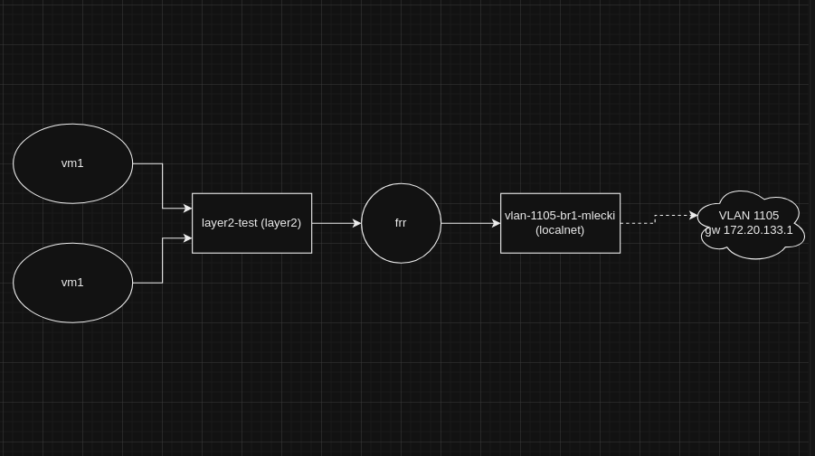

# How to use OVN K layer2 and localnet type networks on OpenShift 4.14+ to implement a dynamic networking solution for Virtual Machines

This repo hosts all the files needed to create a basic FRR router pod on OpenShift 4.14+ that you can use as router to route traffic 
in/out Virtual Machines running on OpenShift virtualization. The overall goal here is to use additional network intrafce on the worker nodes 
for layer 3 direct routed access to the Virtual Machines hosted on the same worker nodes. The last part of the instructions disables port 
security on the OVN switch ports. We need to do this to acomplish two things:
* Allow the OVN ports to pass routed traffic
* Allow VRRP advertisements on the OVN ports

## Steps to create the networks, routers and test VMs:
* create a namespace
```
oc apply -f 01-project.yaml
```
* create the layer2 overlay network (this is the network where VMs are attached as well)
```
oc apply -f 02-layer2-no-subnet.yaml
```
* create ovs bridge **ovs-br1** on all the worker nodes and connect it to physical NIC **ens4f1**
```
oc apply -f 03-ovs-br1.yaml
````
* create the localnet overlay (this is where the FRR pod connects for external connectvity)
```
oc apply -f 04-vlan-1105-br1-mlecki-no-subnets.yaml
```
* enable ip_forwarding on **ens4f1**
```
oc apply -f 05-tuned-enable-ipforwarding.yaml
```
* create a configMap with config for the FRR router pods
```
oc apply -f 06-frr-configmap.yaml
```
* create the FRR router pods (one per worker node)
```
oc apply -f 07-frr-pod_ip_forward_vrrp.yaml
```
* create vm1 for testing
```
oc apply -f 08-vm1-cloud-init-net.yaml
```
* create vm2 for testing
```
oc apply -f 09-vm2-cloud-init-net.yaml
```

The easy part is now done!

## Workaround steps to disable port securtity on OVN ports:
* List pods in "openshift-ovn-kubernetes" namespace and take note of the pods running on the worker nodes where we have FRR pods (in this case its all 3 workers):
```
oc get po -o wide -n openshift-ovn-kubernetes
```
<table><tr><td>
NAME                                     READY   STATUS    RESTARTS   AGE     IP              NODE               NOMINATED NODE   READINESS GATES
ovnkube-control-plane-7b55b77bdd-gpm6w   2/2     Running   0          4d23h   172.20.131.22   ocp-gpu-control3   <none>           <none>
ovnkube-control-plane-7b55b77bdd-hzg2h   2/2     Running   0          4d23h   172.20.131.20   ocp-gpu-control1   <none>           <none>
ovnkube-node-9d2rr                       8/8     Running   0          2d3h    172.20.131.24   ocp-gpu-worker2    <none>           <none>
ovnkube-node-f7sxs                       8/8     Running   0          2d3h    172.20.131.22   ocp-gpu-control3   <none>           <none>
ovnkube-node-gcgnn                       8/8     Running   0          2d3h    172.20.131.25   ocp-gpu-worker3    <none>           <none>
ovnkube-node-gtkps                       8/8     Running   0          2d3h    172.20.131.23   ocp-gpu-worker1    <none>           <none>
ovnkube-node-lqct5                       8/8     Running   0          2d3h    172.20.131.20   ocp-gpu-control1   <none>           <none>
ovnkube-node-zh7jd                       8/8     Running   0          2d3h    172.20.131.21   ocp-gpu-control2   <none>           <none>
</table></tr></td>
* Login to ovnkube pods running on each of the workers:
```
oc rsh -n openshift-ovn-kubernetes ovnkube-node-gtkps
```
* Find all the OVN layer2 and localnet ports attached to the FRR router POD:
```
sh-5.1# ovn-nbctl show | grep -E 'layer2.test|vlan.1105' | grep ext-gw-ocp-gpu
```
<table><tr><td>
    port mlecki.layer2.test_mlecki_ext-gw-ocp-gpu-worker3
    port mlecki.layer2.test_mlecki_ext-gw-ocp-gpu-worker1
    port mlecki.layer2.test_mlecki_ext-gw-ocp-gpu-worker2
    port mlecki.vlan.1105.br1.mlecki_mlecki_ext-gw-ocp-gpu-worker2
</table></tr></td>
* Disable port security on all the discovered OVN ports
```
ovn-nbctl set logical_switch_p mlecki.layer2.test_mlecki_ext-gw-ocp-gpu-worker1 port_security='[]'
ovn-nbctl set logical_switch_p mlecki.layer2.test_mlecki_ext-gw-ocp-gpu-worker2 port_security='[]'
ovn-nbctl set logical_switch_p mlecki.layer2.test_mlecki_ext-gw-ocp-gpu-worker3 port_security='[]'
ovn-nbctl set logical_switch_p mlecki.vlan.1105.br1.mlecki_mlecki_ext-gw-ocp-gpu-worker1 port_security='[]'
```
* Validate new port security setting (should be empty like this - [])
```
sh-5.1# ovn-nbctl list logical_switch_p mlecki.layer2.test_mlecki_ext-gw-ocp-gpu-worker1
```
<table><tr><td>
_uuid               : 6649c54c-720b-42c1-8271-4e0167a297e7
addresses           : ["0a:58:0a:64:c8:6d 10.100.200.109"]
dhcpv4_options      : []
dhcpv6_options      : []
dynamic_addresses   : []
enabled             : []
external_ids        : {"k8s.ovn.org/nad"="mlecki/layer2-test", "k8s.ovn.org/network"=l2-network, "k8s.ovn.org/topology"=layer2, namespace=mlecki, pod="true"}
ha_chassis_group    : []
mirror_rules        : []
name                : mlecki.layer2.test_mlecki_ext-gw-ocp-gpu-worker1
options             : {iface-id-ver="902021ad-7632-42fb-bd56-d393da06f09f", requested-chassis=ocp-gpu-worker1, requested-tnl-key="95"}
parent_name         : []
port_security       : []
tag                 : []
tag_request         : []
type                : ""
up                  : true
</table></tr></td>
```
sh-5.1# ovn-nbctl list logical_switch_p mlecki.vlan.1105.br1.mlecki_mlecki_ext-gw-ocp-gpu-worker1
```
<table><tr><td>
_uuid               : 9e18976c-25e2-4108-a41c-87f565a58c26
addresses           : ["0a:58:ac:14:85:39 172.20.133.57"]
dhcpv4_options      : []
dhcpv6_options      : []
dynamic_addresses   : []
enabled             : []
external_ids        : {"k8s.ovn.org/nad"="mlecki/vlan-1105-br1-mlecki", "k8s.ovn.org/network"=bridge-mlecki, "k8s.ovn.org/topology"=localnet, namespace=mlecki, pod="true"}
ha_chassis_group    : []
mirror_rules        : []
name                : mlecki.vlan.1105.br1.mlecki_mlecki_ext-gw-ocp-gpu-worker1
options             : {iface-id-ver="902021ad-7632-42fb-bd56-d393da06f09f", requested-chassis=ocp-gpu-worker1}
parent_name         : []
port_security       : []
tag                 : []
tag_request         : []
type                : ""
up                  : true
</table></tr></td>
* ***VERY IMPORTANT:*** Repeat steps 2-5 on each of the ovn kube pods you found in step 1.

## Validation
* Validate BGP is receiving routes from the upstream routers on each of the FRR PODs:
```
ext-gw-ocp-gpu-worker1# show ip route bgp 
```
<table><tr><td>
Codes: K - kernel route, C - connected, S - static, R - RIP,
       O - OSPF, I - IS-IS, B - BGP, E - EIGRP, N - NHRP,
       T - Table, v - VNC, V - VNC-Direct, A - Babel, F - PBR,
       f - OpenFabric,
       > - selected route, * - FIB route, q - queued, r - rejected, b - backup
       t - trapped, o - offload failure

B>* 0.0.0.0/0 [20/0] via 172.20.133.2, net2, weight 1, 20:05:37
B>* 172.20.0.0/24 [20/0] via 172.20.133.2, net2, weight 1, 20:05:37
B>* 172.20.1.0/24 [20/0] via 172.20.133.2, net2, weight 1, 20:05:37
B>* 172.20.2.0/24 [20/0] via 172.20.133.2, net2, weight 1, 20:05:37
</table></tr></td>
* Validate BGP is advertising routes of the layer2 subnets:
```
ext-gw-ocp-gpu-worker1# show ip bgp neighbors 172.20.133.2 advertised-routes 
```
<table><tr><td>
BGP table version is 58, local router ID is 172.20.148.10, vrf id 0
Default local pref 100, local AS 65530
Status codes:  s suppressed, d damped, h history, * valid, > best, = multipath,
               i internal, r RIB-failure, S Stale, R Removed
Nexthop codes: @NNN nexthop's vrf id, < announce-nh-self
Origin codes:  i - IGP, e - EGP, ? - incomplete
RPKI validation codes: V valid, I invalid, N Not found

    Network          Next Hop            Metric LocPrf Weight Path
 *> 172.20.148.0/24  0.0.0.0                  0         32768 ?

Total number of prefixes 1
</table></tr></td>